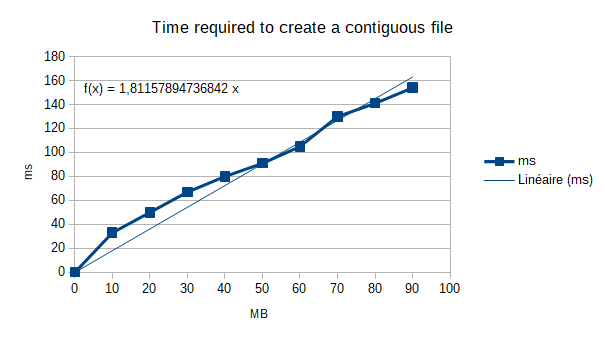

# IO API manual

## Table of contents

- [Getting started](#getting-started)
- [io.c](#ioc)
  * [IO_FileDescriptor structure](#io_filedescriptor-structure)
  * [io_open](#io_open)
  * [io_read](#io_read)
  * [io_write](#io_write)
  * [io_sync](#io_sync)
  * [io_size](#io_size)
  * [io_error](#io_error)
  * [io_create_contiguous](#io_create_contiguous)
  * [io_truncate](#io_truncate)
  * [io_close](#io_close)
  * [io_set_timestamp](#io_set_timestamp)
  * [io_tell](#io_tell)
  * [io_lseek](#io_lseek)
- [IO_tests.c](#io_testsc)
  * [IO_fatfs_simple_Test](#io_fatfs_simple_test)
  * [IO_ioapi_simple_Test](#io_ioapi_simple_test)
  * [IO_fatfs_speed_Test](#io_fatfs_speed_test)
  * [IO_ioapi_speed_Test](#io_ioapi_speed_test)
  * [IO_contiguous_speed_Test](#IO_contiguous_speed_Test)
  * [Speed test results](#speed-test-results)
- [timer.c](#timerc)
  * [timer_chronoStart](#timer_chronostart)
  * [timer_getTime](#timer_gettime)
- [Third party documentation](#third-party-documentation)
- [Contributing](#contributing)
- [Authors](#authors)
- [License](#license)
- [Acknowledgments](#acknowledgments)

## Getting started

This library aims at improving [FatFs](http://elm-chan.org/fsw/ff/00index_e.html) in matter of write/read speed.
When using this library, every file operation is aligned with sectors, as explained below.

This documentation only details the API, docs about static functions are only in the C files.

## [io.c](../Src/io.c)

This file contains the core functions of the library : a set of functions to read/write efficiently.
The API depends on FatFs.

FAT filesystems are divided in sectors (512, 1024, 2048 or 4096 byes).
To read/write efficiently, it's important that read/write operations stay aligned with sectors, as explained in [FatFs module application note](http://elm-chan.org/fsw/ff/doc/appnote.html#fs1).

To do that, IO API uses a buffer which size is a multiple of sectors size.
Buffer's size can be customized with *BUF_MULTIPLIER* define.

When the user requests IO API to read some random part of a file, IO API asks FatFs for a bigger part of the file to stay aligned with sectors, and store the data in the buffer.
The buffer also acts as a cache, there is one per file and it's kept until the file is closed.

You may check the speed tests [results](#speed-test-results) that I had on the STM32F4 Discovery board.

[IO_tests.c](../Src/IO_tests.c) provides examples of how to use the API.

### IO_FileDescriptor structure

This structure acts as a file descriptor, and must be used to with IO functions.
It is defined automatically when calling *io_open()*.

### io_open

```
IO_FileDescriptor* io_open(const TCHAR* path,
                           BYTE mode);
```

Opens or create a file.

Parameters :
 * ```const TCHAR* path``` : (in) pointer to the null-terminated string that specifies the file name to open or create.
 * ```BYTE mode``` : (in) mode flags that specifies the type of access and open method for the file.
 See [f_open](http://elm-chan.org/fsw/ff/doc/open.html) docs for details.
 
Return value : Pointer to a IO_FileDescriptor structure, or NULL in case of error.

### io_read
```
void* io_read(IO_FileDescriptor* fp, 
              UINT position, 
              UINT btr, 
              UINT* br)
```

Reads the contents of a file.

Parameters :
 * ```IO_FileDescriptor* fp``` : (in) the file object
 * ```UINT position``` : (in) position in the file to start reading (first byte is number 0)
 * ```UINT btr``` : (in) number of bytes to read
 * ```UINT* br``` : (out) pointer to the variable to return number of bytes read

Return value : pointer to the buffer containing data, NULL in case of error.

Check the new value of *br* after calling the function, in case you reached the end of the file.
For example, if you request 255 bytes starting from the last byte of the file, then the buffer will be 1 byte long and will only contain the last byte of the file.

### io_write

```
FRESULT io_write(IO_FileDescriptor* fp,
                 const void* buff,
                 UINT position,
                 UINT btw,
                 UINT* bw)
```

Writes data in a file. If *position* argument is bigger than file size, then the hole is automatically filled with zeroes.
Zeroes are put one by one in the file as FAT filesystems don't support sparse files, according to [NTFS.com](http://www.ntfs.com/ntfs_vs_fat.htm).

This function needs that FF_FS_MINIMIZE == 0 when expanding file size (to be able to check if disk is full)

Parameters :
 * ```IO_FileDescriptor* fp``` : (in) the file object
 * ```const void* buff``` : (in) pointer to the data buffer to be written on the file
 * ```UINT position``` : (in) position in the file to start reading (first byte is number 0)
 * ```UINT btw``` : (in) number of bytes to write
 * ```UINT* bw``` : (out) pointer to the variable to return number of bytes written

Return value : FRESULT error code, same as [f_write](http://elm-chan.org/fsw/ff/doc/write.html). If everything is OK then return value is *FR_OK*.


### io_sync

```
FRESULT io_sync(IO_FileDescriptor* fp)
```
Saves cached data. It is not necessary to use this before closing a file, as *io_close* calls *io_sync*.
This function may encounter an error if you are in read-only mode.

Parameters :
 * ```IO_FileDescriptor* fp``` : (in) the file object

Return value : FRESULT error code, same as [f_sync](http://elm-chan.org/fsw/ff/doc/sync.html). If everything is OK then return value is *FR_OK*.

### io_size

```
FRESULT io_size(IO_FileDescriptor* fp,
                FSIZE_t* size)
```
Give the size of the file in unit of byte, taking in consideration unsaved changes.

Parameters :
 * ```IO_FileDescriptor* fp``` : (in) the file object
 * ```FSIZE_t* size```: (out) pointer to the variable that will contain the size of the file in unit of byte

Return value : FRESULT error code

### io_error

```
FRESULT io_error(IO_FileDescriptor* fp)
```
Tests for an error in a file

Parameters :
 * ```IO_FileDescriptor* fp``` : (in) the file object

Return value : FRESULT: FR_OK if there is no error.

### io_create_contiguous

```
IO_FileDescriptor* io_create_contiguous(const TCHAR* path,
                                        BYTE mode,
                                        FSIZE_t size)
```
Create and open a contiguous file

If a file with specified name already exists, it will be deleted !
No need to call *io_open()* if *io_create_contiguous()* doesn't encounter any error.
But don't forget to call *io_close()* when you have finished with this file.

Parameters :
 * ```const TCHAR* path``` : (in) pointer to the null-terminated string that specifies the file name to create.
 * ```BYTE mode``` : (in) mode flags that specifies the type of access and open method for the file.
 See [f_open](http://elm-chan.org/fsw/ff/doc/open.html) docs for details.
 No need to specify *FA_WRITE* or *FA_CREATE_ALWAYS* as they are automatically set
 * ```FSIZE_t size``` : (in) desired file size

Return value: Pointer to a IO_FileDescriptor structure, or NULL in case of error.

You can except an error if:
 * No free contiguous space was found.
 * Not allowable file size. (>= 4 GB on FAT volume)

### io_truncate

```
FRESULT io_truncate(IO_FileDescriptor* fp,
                    FSIZE_t newSize)
```
Changes a file's size (not possible in read-only mode).
When expanding the file, space will be automatically pre allocated.

Parameters :
 * ```IO_FileDescriptor* fp``` : (in) the file object
 * ```FSIZE_t newSize``` : (in) new file size

Return value : FRESULT: FR_OK if there is no error.

### io_close

```
FRESULT io_close(IO_FileDescriptor* fp)
```

Close a file (and free the buffer associated to it).
This function may encounter an error if you are in read-only mode (because if you tried to write on the file, your changed are only saved when caling *io_close* or *io_sync*).

Parameters :
 * ```IO_FileDescriptor* fp``` : (in) the file object
 
Return value : FRESULT error code, same as [f_close](http://elm-chan.org/fsw/ff/doc/close.html).
If everything is OK then return value is *FR_OK*.

### io_set_timestamp

```
FRESULT io_set_timestamp(const TCHAR* path,
                         uint16_t year,
                         uint8_t month,
                         uint8_t day,
                         uint8_t hour,
                         uint8_t min,
                         uint8_t sec);
```
Changes the timestamp of a file (creation time)

Parameters :
 * ```const TCHAR* path``` : (in) pointer to the null-terminated string that specifies the file name to open or create.
 * ```uint16_t year```: (in) creation year
 * ```uint8_t month```: (in) creation month
 * ```uint8_t day```: (in) creation day
 * ```uint8_t hour```: (in) creation hour
 * ```uint8_t min```: (in) creation minutes
 * ```uint8_t sec```: (in) creation seconds
 
Return value: FRESULT error code (FR_OK if everything if fine)
 
### io_tell

```
FRESULT io_tell(IO_FileDescriptor* fp,
                FSIZE_t* rwPointer);
```
Gives the current position of read/write pointer

Parameters:
 * ```IO_FileDescriptor* fp``` : (in) the file object
 * ```FSIZE_t* rwPointer```: (out) Pointer to the variable to store read/write pointer

Return value: FRESULT error code (FR_OK if everything if fine)

### io_lseek
```
FRESULT io_lseek(IO_FileDescriptor* fp,
                 FSIZE_t rwPointer)
```
Moves the current position of read/write pointer.
Can also be used to expand the file size if you set the new pointer over current file size.

It's not possible to expand file size if the file is in read only mode.

Parameters:
 * ```IO_FileDescriptor* fp``` : (in) the file object
 * ```FSIZE_t rwPointer```: (in) byte offset from beginning of the file to set read/write pointer.

Return value: FRESULT error code (FR_OK if everything if fine)

## [IO_tests.c](../Src/IO_tests.c)

This file contains read/write tests on file system. 
Most functions return a ```IO_TESTS_ErrorCode```, which is defined in [IO_tests.h](project/SourceCode/Inc/IO_tests.h). 
These functions aim at testing the hardware, as software already passed unit tests.

Speed tests read/write random data continuously in the file : they don't read/write several time at the same place.
I did that because it's an accurate representation of what happen most of the time.
Writing or reading several times at the same place would be very fast using IO API as it only consists of filling/reading a buffer; data is written in the file only when using *io_sync()* or *io_close()*.

### IO_fatfs_simple_Test

```IO_TESTS_ErrorCode IO_fatfs_simple_Test(void)```

The aim of this function is to quickly test FatFs, the filesystem and the hardware related to the mass storage.

This funciton performs tries to write and read a random string of 32 bytes in a random file.
If any operation on file system fails, it returns IO_TESTS_ERR.
If something went wrong outside of the file system, it returns IO_TESTS_SYS_ERR.
Else, it returns IO_TESTS_OK.

Here is a list of operations performed by the function :
 * generate valid random strings for the file's name and its contents
 * create file with *f_open*
 * write random data with *f_write*
 * close file with *f_close*
 * open file with *f_open*
 * read file with *f_read*
 * compare strings with *strncmp*
 * close file with *f_close*
 * delete file with *f_unlink*
 * check that the file doesn't exist anymore

### IO_ioapi_simple_Test

```IO_TESTS_ErrorCode IO_ioapi_simple_Test(void)```

The aim of this function is to test that IO API works. It's very similar to *IO_fatfs_simple_Test* function.

This funciton performs tries to write and read a random string of 2048 bytes in a random file.
If any operation on file system fails, it returns IO_TESTS_ERR.
If something went wrong outside of the file system, it returns IO_TESTS_SYS_ERR.
Else, it returns IO_TESTS_OK.

Here is a list of operations performed by the function :
 * generate valid random strings for the file's name and its contents
 * create file with *io_open*
 * write random data with *io_write*
 * close file with *io_close*
 * open file with *io_open*
 * read file with *io_read*
 * compare strings with *strncmp*
 * close file with *io_close*
 * delete file with *f_unlink*
 * check that the file doesn't exist anymore

### IO_fatfs_speed_Test

```
IO_TESTS_ErrorCode IO_fatfs_speed_Test(UINT bytes, 
                                       UINT total_size, 
                                       uint32_t* write_time, 
                                       uint32_t* read_time)
```

Performs a basic read/write speed test only using FatFs. Results precision is 1 millisecond.
A file is created and filled with random data according to given parameters.
Then the same file is read.
Each byte in the file is write/read only once (that's what happen most of the time in the real life).
The time to open and close the file is also counted.

Parameters :
 * ```UINT bytes``` : (in) Number of bytes to write at one time (max: 512 bytes).
 Basically, it's the size of the buffer FatFs will interact with.
 * ```UINT total_size``` : (in) Size of the file to test on (in bytes)
 * ```uint32_t* write_time``` : (out) Milliseconds to do the write process
 * ```uint32_t* read_time``` : (out) Milliseconds to do the read process

Return value : IO_TESTS_ErrorCode, *IO_TESTS_OK* if no error occured.

### IO_ioapi_speed_Test

```
IO_TESTS_ErrorCode IO_ioapi_speed_Test(UINT bytes, 
                                       UINT total_size, 
                                       uint32_t* write_time, 
                                       uint32_t* read_time)
```

Performs a basic read/write speed test using IO API.
Results precision is 1 millisecond.
The process is the same than in *IO_fatfs_speed_Test()*.
Each byte in the file is write/read only once (that's what happen most of the time in the real life).

Parameters :
 * ```UINT bytes``` : (in) Number of bytes to write at one time (max: 512 bytes).
 * ```UINT total_size``` : (in) Size of the file to test on (in bytes)
 * ```uint32_t* write_time``` : (out) Milliseconds to do the write process
 * ```uint32_t* read_time``` : (out) Milliseconds to do the read process

Return value : IO_TESTS_ErrorCode, *IO_TESTS_OK* if no error occured.

### IO_contiguous_speed_Test

```
IO_TESTS_ErrorCode IO_contiguous_speed_Test(FSIZE_t size,
                                            uint32_t* time);
```

Performs a speed test with IO API to create a contiguous file.
Results precision is 1 millisecond.

Parameters :
 * ```FSIZE_t size``` : (in) Size of the file to create
 * ```uint32_t* time``` : (out) Milliseconds to create the file

Return value : IO_TESTS_ErrorCode, *IO_TESTS_OK* if no error occured.

### Speed test results

These speed tests used *IO_ioapi_speed_Test()*, *IO_ioapi_speed_Test()* and *IO_contiguous_speed_Test()*.
For the read/write tests, the amount of data to write/read was 65kB (0xFFFF bytes exactly).
For the contiguous file test, created file's size was multiples of 10MB.
My SD card had 512 bytes sectors.

I tested on my board (STM32F4 Discovery) with an SD card connected via USB, the results may be differents on other hardware.
I configured IO API buffer to 1 sector (*BUF_MULTIPLIER* = 1), that's the minimum.

|Task|FatFs|IO API|Relative difference|
|--|--|--|--|
|Write 65kB, 1 byte at a time|503ms|383ms|-23,8%|
|Write 65kB, 1 sector at a time|135ms|141ms|+4,4%|
|Read 65kB, 1 byte at a time|460ms|345ms|-25%|
|Read 65kB, 1 sector at a time|112ms|117ms|+4,5%|

These results show that in most cases, it's more efficient to use *io_read()* or *io_write()* than *f_read()* or *f_write()*, but if your data is always aligned with sectors, then it's a little faster to use FatFs functions.

Here are the results for the contiguous file creation time :



When creating a contiguous file, remember that it should require about **1,8ms/MB**.

## [timer.c](../Src/timer.c)

This file contains functions to measure time, basically, it's just an extremly simple chronometer.
I use it to perform speed tests.
It depends on HAL drivers, to implement it without HAL drivers, use actual timers.

### timer_chronoStart

```
void timer_chronoStart(void)
```

Starts or resets the chronometer to 0 ms.

### timer_getTime

```
uint32_t timer_getTime(void)
```

Get the time in milliseconds since the last call to *timer_chronoStart()*.
If you use it without calling *timer_chronoStart()*, return value will just be an uninitialized variable.

Return value : chronometer value in milliseconds (32 bits)


## Third party documentation

 * [FatFs](http://elm-chan.org/fsw/ff/00index_e.html)
 * [CppUTest Manual](https://cpputest.github.io/manual.html)

## Contributing

Contributions are always welcome !

Feel free to create an issue if you found a bug or if you have an idea of improvement.
If you want to solve an issue or implement a new feature by yourself, you can fork the repository and make a pull request

## Authors

* [**Alban Benmouffek**](https://github.com/sonibla)

See also the list of [contributors](https://github.com/StepUp-Solutions/FatFs-enhancements/contributors) who participated in this project.

## License

Unless otherwise stated, the source code in this repository is licensed under the [MIT License](https://tldrlegal.com/license/mit-license) - see the [LICENSE](../LICENSE.md) file for details

## Acknowledgments

A huge thank you to Charles Gayot for letting me opensource this repository ! :heart:
